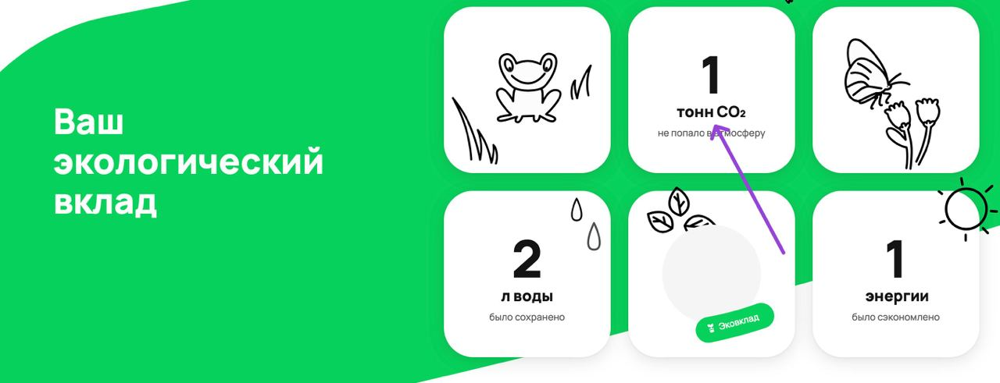
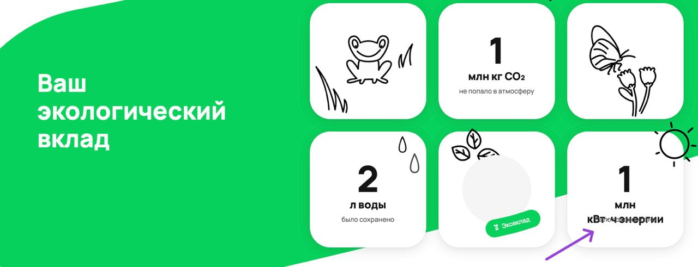
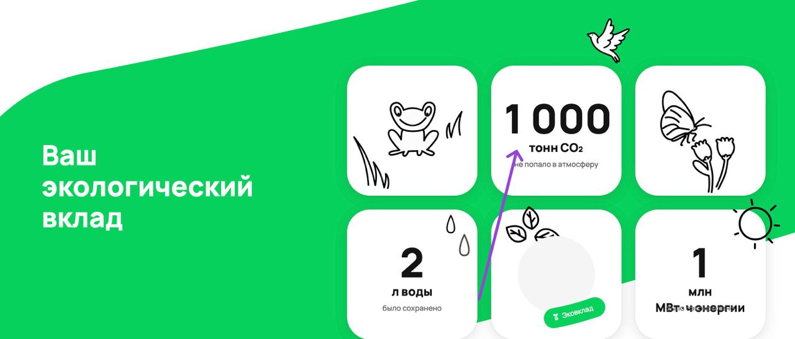
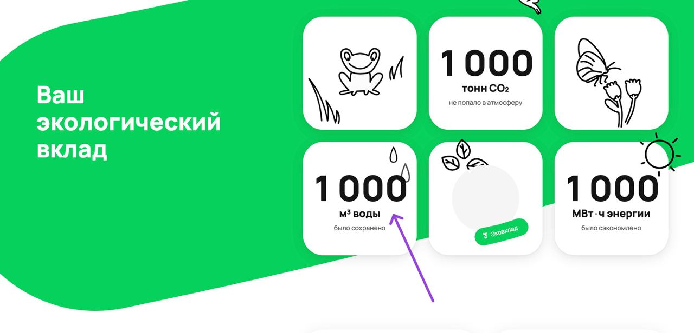
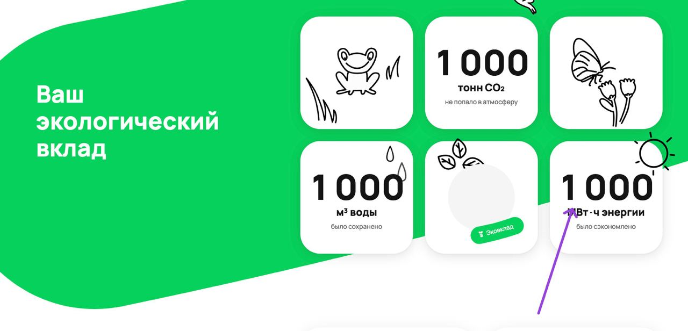
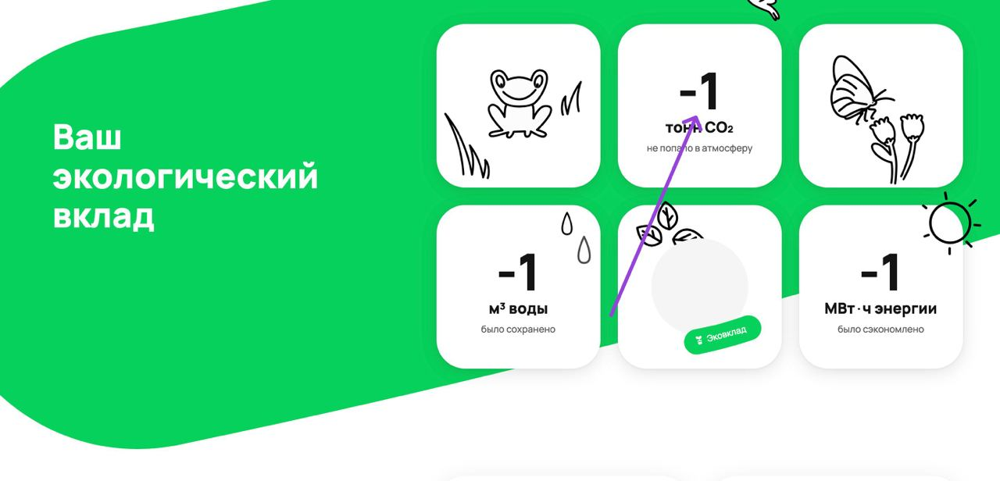
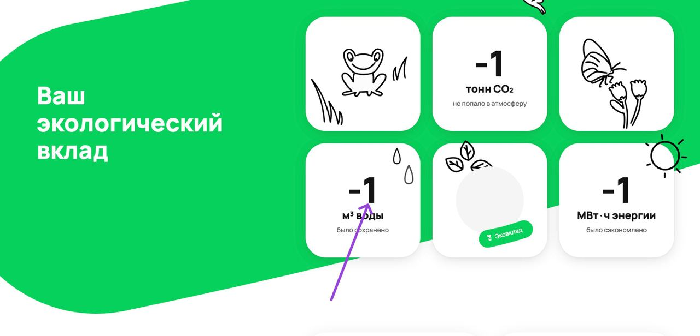
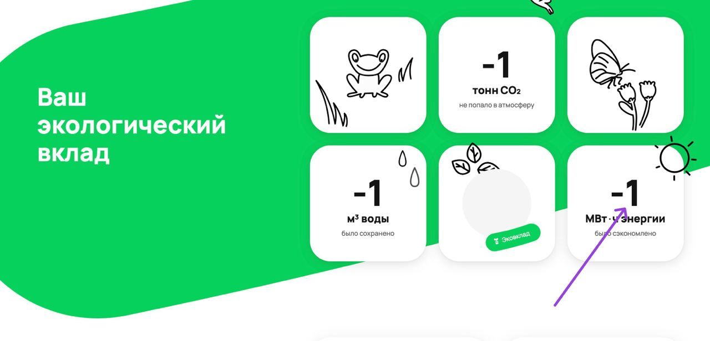

## BUG-1

### Название: Отсутсвует склонение при значении счётчика СО2 "1 тонн"

### Предусловие:

1. Подменить данные счётчика СО2 на "1000".
2. Перейти на [страницу](https://www.avito.ru/avito-care/eco-impact) эковклада на десктопной версии.
2. Авторизоваться.

### Шаги:

1. Доскролить до счетчиков.
2. Сделать скриншот счетчика СО2.

### ОР:

1. Значения счётчика СО2 на скриншоте будет "1 тонна".

### ФР:

1.  Значения счётчика СО2 на скриншоте  "1 тонн".
    

### Окружение: ОС macOS Sonoma 14.2.1, Safari браузер версия 17.2.1

### Приоритет: low

## BUG-2

### Название: Значения счётчика энергии 1 млн перекрывает надпись "Было сэкономлено"

### Предусловие: 
1. Подменить данные счётчика энергии на "1000000".
2. Перейти на [страницу](https://www.avito.ru/avito-care/eco-impact) эковклада на десктопной версии.
3. Авторизоваться.

### Шаги:

1. Доскролить до счетчиков.
2. Сделать скриншот счетчика энергии.

### ОР:

1. Значение счётчика 1 млн (кВт) ч энергии не прекрывает надпись "было сохраненно".

### ФР:

1.  Значение счётчика 1 млн кВт ч энергии прекрывает надпись "было сохраненно".
    

### Окружение: ОС macOS Sonoma 14.2.1, Safari браузер версия 17.2.1

### Приоритет: medium.

## BUG-3

### Название: При значении счётчика СО2 999 999 (999 999 999 / 999 999 999 999) происходит неверное округление.

### Предусловие:
1. Подменить данные счётчика СО2 на "999 999 (999 999 999 / 999 999 999 999)".
2. Перейти на [страницу](https://www.avito.ru/avito-care/eco-impact) эковклада на десктопной версии.
3. Авторизоваться.

### Шаги:

1. Доскролить до счетчиков.
2. Сделать скриншот счетчика СО2.

### ОР:

1. Значение счётчика СО2 будет 999999 , либо округлится до 1 млн тонн (при значениях 999 999 999 / 999 999 999 999 должны происходить подобные изменения).

### ФР:

1.  Значение счётчика СО2 1 000 000  (при значениях 999 999 999 / 999 999 999 999 происходит подобное неправильное округление).
    

### Окружение: ОС macOS Sonoma 14.2.1, Safari браузер версия 17.2.1

### Приоритет: low.

# BUG-4

### Название: При значении счётчика воды 999 999 (999 999 999 / 999 999 999 999) происходит неверное округление.

### Предусловие:
1. Подменить данные счётчика воды на "999 999 (999 999 999 / 999 999 999 999)".
2. Перейти на [страницу](https://www.avito.ru/avito-care/eco-impact) эковклада на десктопной версии.
3. Авторизоваться.

### Шаги:

1. Доскролить до счетчиков.
2. Сделать скриншот счетчика воды.

### ОР:

1. Значение счётчика воды будет 999999 , либо округлится до 1 млн тонн (при значениях 999 999 999 / 999 999 999 999 должны происходить подобные изменения).

### ФР:

1.  Значение счётчика воды 1 000 000  (при значениях 999 999 999 / 999 999 999 999 происходит подобное неправильное округление).
    

### Окружение: ОС macOS Sonoma 14.2.1, Safari браузер версия 17.2.1

### Приоритет: low.

# BUG-5

### Название: При значении счётчика энергии ' 999 999 (999 999 999 / 999 999 999 999) происходит неверное округление.

### Предусловие:
1. Подменить данные счётчика энергии на "999 999 (999 999 999 / 999 999 999 999)".
2. Перейти на [страницу](https://www.avito.ru/avito-care/eco-impact) эковклада на десктопной версии.
3. Авторизоваться.

### Шаги:

1. Доскролить до счетчиков.
2. Сделать скриншот счетчика энергии.

### ОР:

1. Значение счётчика энергии будет 999999 , либо округлится до 1 млн тонн (при значениях 999 999 999 / 999 999 999 999 должны происходить подобные изменения).

### ФР:

1.  Значение счётчика энергии 1 000 000  (при значениях 999 999 999 / 999 999 999 999 происходит подобное неправильное округление).
    

### Окружение: ОС macOS Sonoma 14.2.1, Safari браузер версия 17.2.1

### Приоритет: low.

# BUG-6

### Название: Неверное отображение счётчика СО2 при отрцательном значении счётчиков.

### Предусловие:
1. Подменить данные счётчика СО2  на "-1000".
2. Перейти на [страницу](https://www.avito.ru/avito-care/eco-impact) эковклада на десктопной версии.
3. Авторизоваться.

### Шаги:

1. Доскролить до счетчиков.
2. Сделать скриншот счетчика СО2.

### ОР:

1. Значения счётчика СО2 будет "NaN" либо "0".

### ФР:

1.  Значения счётчиков СО2 отрицательное. 
    

### Окружение: ОС macOS Sonoma 14.2.1, Safari браузер версия 17.2.1

### Приоритет: low.

# BUG-7

### Название: Неверное отображение счётчика воды при отрцательном значении счётчиков.

### Предусловие:
1. Подменить данные счётчика воды  на "-1000".
2. Перейти на [страницу](https://www.avito.ru/avito-care/eco-impact) эковклада на десктопной версии.
3. Авторизоваться.

### Шаги:

1. Доскролить до счетчиков.
2. Сделать скриншот счетчика воды.

### ОР:

1. Значения счётчика воды будет "NaN" либо "0".

### ФР:

1.  Значения счётчика воды отрицательное.
    

### Окружение: ОС macOS Sonoma 14.2.1, Safari браузер версия 17.2.1

### Приоритет: low.

# BUG-8

### Название: Неверное отображение счётчика энергии при отрцательном значении счётчиков.

### Предусловие:
1. Подменить данные счётчика энергии  на "-1000".
2. Перейти на [страницу](https://www.avito.ru/avito-care/eco-impact) эковклада на десктопной версии.
3. Авторизоваться.

### Шаги:

1. Доскролить до счетчиков.
2. Сделать скриншот счетчика энергии.

### ОР:

1. Значения счётчика энергии будет "NaN" либо "0".

### ФР:

1.  Значения счётчика энергии отрицательное.
    

### Окружение: ОС macOS Sonoma 14.2.1, Safari браузер версия 17.2.1

### Приоритет: low.