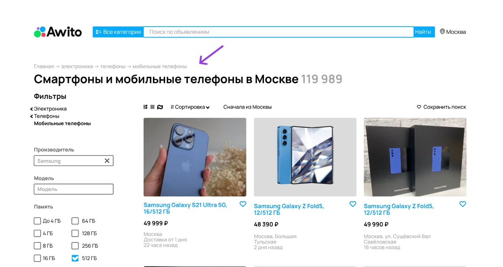
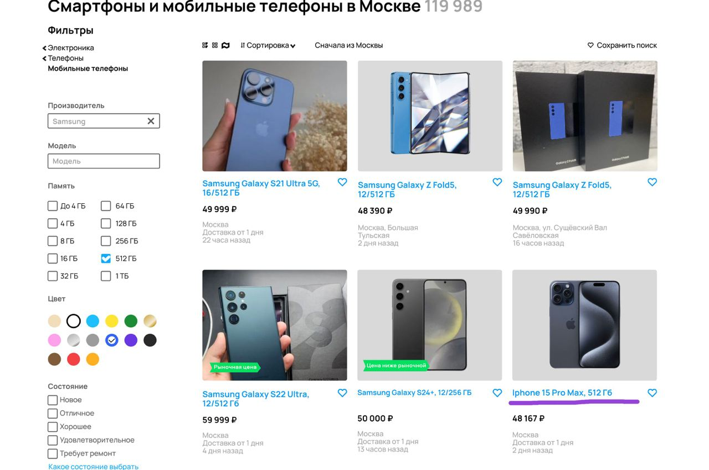
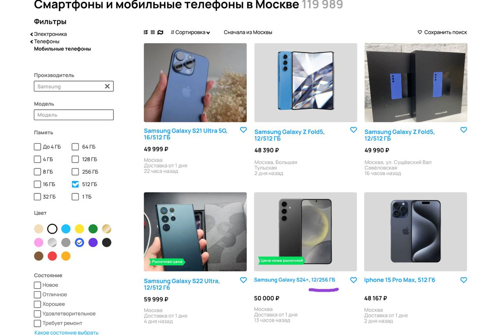
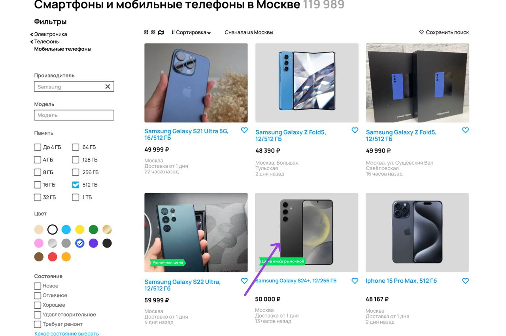
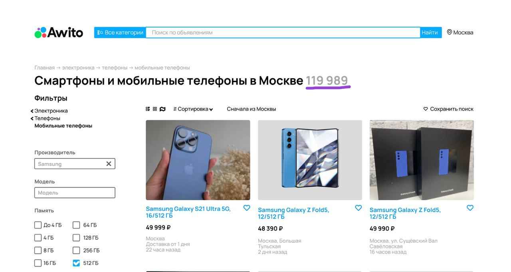
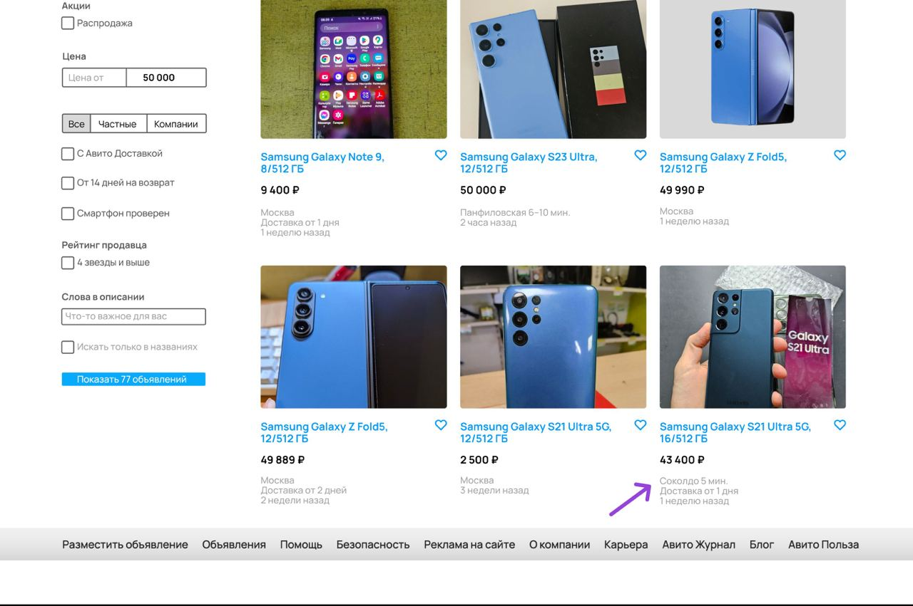
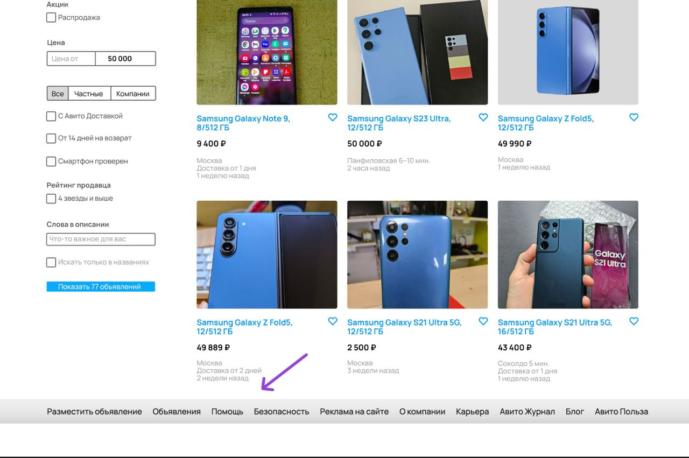
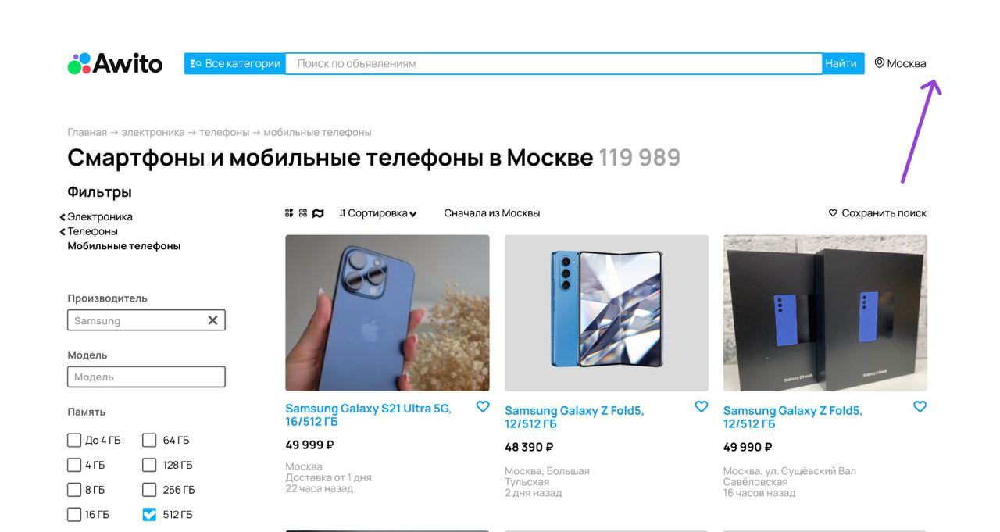
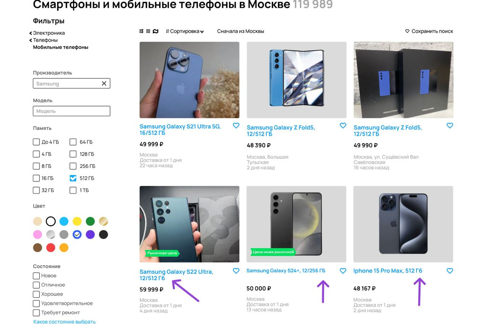
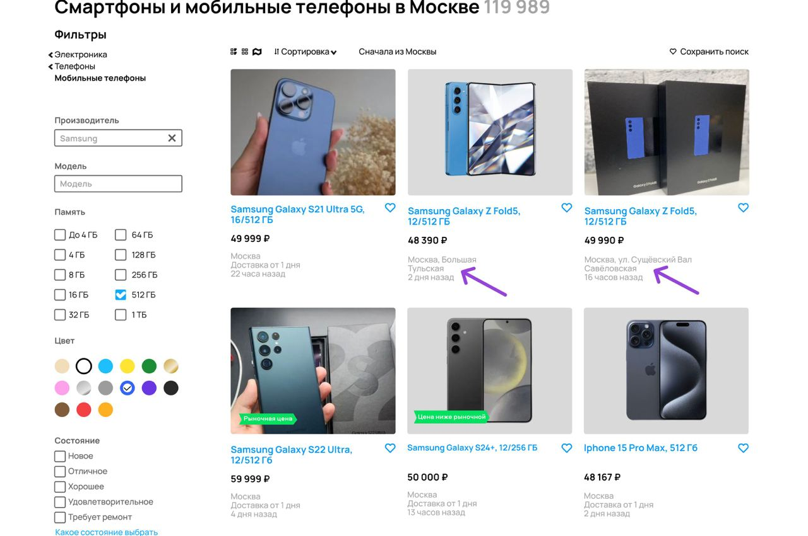

# Задание 1.

1. Ошибка в логотипе - "Awito" вместо "Avito".
   
   Приоритет: **high**.
2. Строка поиска по объявлениям больше чем рядом стоящие кнопки.
   
   Приоритет: **low**.
3. Не правильные значки выбора отображения товаров. Выбранный стиль отображения выделяется черной жирной обводкой. Остальные значки отображения светло-серые.
   
   Приоритет: **medium**.
4. В хлебных крошках наименование разделов написаны с маленькой буквы.
   
   Приоритет: **low**.
5. В хлебных крошках между разделами значок "->" вместо ">".
   
   Приоритет: **low**.
6. В хлебных крошках отсутсвует "Samsung".
   
   Приоритет: **low**.
7. Отсутствует тумлер "Сначала из Москвы".
   
   Приоритет: **medium**.
8. Фильтр производителя не работает, показывает телефон другой марки.
   
   Приоритет: **medium**.
9. Фильтр по объёму памяти не работает, показывает телефон с иным кол-вом памяти.
   
   Приоритет: **medium**.
10. Фильтр по цвету не работает, показывает телефон другого цвета.
    
    Приоритет: **medium**.
11. Фильр по цене не работает, показывает телефон стоимостью выше максимальной стоимости фильтра.
    
    Приоритет: **medium**.
12. Значения счётчика в кнопке "Показать хх объявлений" отличается не совпадают с значениями счётчиков в подзаголвке "Смартфоны и мобильные телефоны в Москве".
    
    Приоритет: **medium**.
13. Не правильно работает фильтр геолокации, показывает товар в другом несущетвующим населёном пуннкте "Соколдо".
    
    Приоритет: **medium**.
14. Отсутствует нумерация страниц.
    
    Приоритет: **high**.
15. В поле геолокация возле города Москвы в правом верхнем углу отсутствует светло-серая надпись "район, метро, радиус".
    
    Приоритет: **medium**.
16. В разных карточках товара разное написание "ГБ".
    
    Приоритет: **low**.
17. Не указано растояние от метро в карточках товара.
    
    Приоритет: **medium**.
